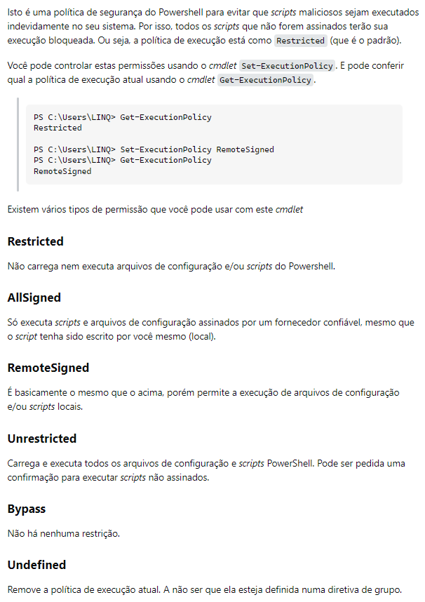

# Git Configurações iniciais 

```
git config --global user.name "nome do seu usuario"
git config --global user.email seuemail@exemplo.br
git config --list 
```


## Problema Para Execução de Scripts no terminal 

"Execução de scripts foi desabilitada neste sistema"



[HKEY_LOCAL_MACHINE\SOFTWARE\Microsoft\PowerShell\1\ShellIds\Microsoft.PowerShell]

HKEY_LOCAL_MACHINE\SOFTWARE\Microsoft\PowerShell\1\ShellIds\ScriptedDiagnostics

"ExecutionPolicy"="bypass"


# Docker 

Habilidar Virtualização
