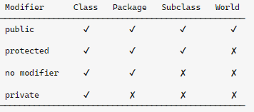

# Problema Para Execução de Scripts no terminal 

## _"Execução de scripts foi desabilitada neste sistema"_

[HKEY_LOCAL_MACHINE\SOFTWARE\Microsoft\PowerShell\1\ShellIds\Microsoft.PowerShell]

HKEY_LOCAL_MACHINE\SOFTWARE\Microsoft\PowerShell\1\ShellIds\ScriptedDiagnostics

"ExecutionPolicy"="bypass"

Gerenciador de Credenciais

Variáveis de Ambiente